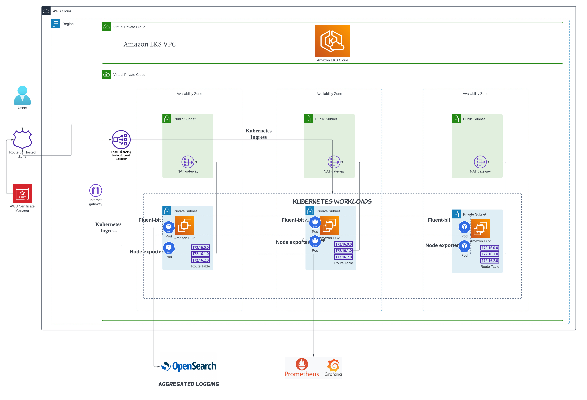

# eks_infra_observability
This repo contains config to create an eks cluster and add-ons such as coredns, kube-proxy, and vpc-cni. Also, it has the kubernetes manifest file to deploy external-dns, cluster auto-scaler and so on.

[Blog post](https://medium.com/@yogeshraj-au/unveiling-the-journey-orchestrating-observability-for-amazon-eks-276385646be5)

Tech Stack:

- Jenkins
- AWS
- Kubernetes
- Prometheus
- Mimir
- Grafana
- Opensearch
- Metrics-Server
- Nginx
- Cert-Manager
- External-DNS
- argocd

# Terraform 

The terraform folder contains modules such as vpc, iam, and eks. It will create vpc, iam, and eks, route53 resources on AWS. 

# Helm

The Helm folder contains values for the helm charts such as metrics-server, fluentbit, OpenSearch, Cert-manager, Ingress-nginx, AWS loadbalancer controller, Prometheus, Mimir, Jenkins, argocd, and Grafana.

# Kubernetes

The kubernetes folder contains manifest files to deploy external-dns, cluster autoscaler and clusterissuer.